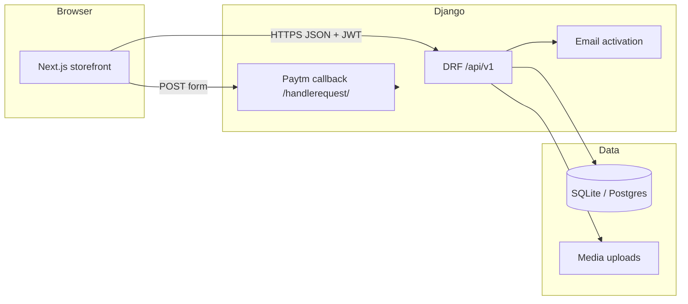

# Architecture

ShopHub is a **split-stack ecommerce demo**: **Next.js 15** (App Router) is the customer-facing storefront; **Django 5** exposes a **REST + JWT** API and owns persistence, payments callback, and transactional email.

## High-level diagram

## Request paths

| Surface | Role |
|--------|------|
| **Next.js** (`frontend/`) | Home, search, PDP, cart (localStorage), **checkout (login required)**, tracker, support, auth (login/signup/activate). |
| **Django `/api/`** | Catalog, products, JWT auth, **order create** (authenticated + idempotency), order track, contact. |
| **Django non-API routes** | Redirects to Next for legacy paths (`/`, `/checkout/`, `/products/<id>`, etc.); **Paytm** return URL serves minimal HTML. |
| **Django admin** | Products, orders (with `user` + `idempotency_key`), contacts. |

## Authentication

1. **Register** → `POST /api/v1/auth/register/` → inactive user + email (HTML + plain text) with **one** link: `DJANGO_FRONTEND_BASE_URL/activate/...` (Next.js only; never the API hostname).
2. **Activate** → user opens the link on Next → in-page `POST /api/v1/auth/activate/` (no browser redirect to Django).
3. **Login** → `POST /api/v1/auth/token/` → JWT `access` + `refresh` stored in **sessionStorage** on the Next app.
4. **Checkout** → `POST /api/v1/orders/` with `Authorization: Bearer <access>`.

## Checkout & orders

- **Cart**: `localStorage` key `cart`, shape `pr<id>: [qty, name, unitPrice]` (compatible with any legacy Django static cart).
- **Place order**: Authenticated only; order row stores **shipping fields** plus **`user`** FK and optional **`idempotency_key`**.
- **Idempotency**: Same user + same `idempotency_key` → **HTTP 200** with existing `order_id` and `idempotent: true` (no duplicate row; no second Paytm payload). Client retries after errors reuse the key via a ref.
- **Paytm**: When `PAYTM_*` env vars are set, create response includes `paytm: { action, fields }`; the browser auto-posts. Otherwise order completes without redirect.

## Order tracking

- **Public** `POST /api/v1/orders/track/` with `order_id` + `email` (must match stored order).
- Next.js tracker UI calls this API.

## Support

- `POST /api/v1/contact/` → Django `Contact` model (same as historical template form).

## Not in scope (demo boundaries)

- No server-side cart or inventory reservation.
- No rate limiting / CAPTCHA on auth or contact (add for production).
- JWT in sessionStorage (consider httpOnly cookies + BFF for production).

## Tests

- **Backend**: `python manage.py test api.tests` — auth on orders, idempotency, amount validation, catalog, track.
- **Frontend**: `cd frontend && npm test` — Vitest on small pure helpers (`validation`, `auth-redirect`).

## Deployment sketch

- **API**: Gunicorn (`Procfile`); set `DJANGO_ALLOWED_HOSTS`, `DJANGO_CORS_ALLOWED_ORIGINS` (your Next origin), `DJANGO_FRONTEND_BASE_URL`.
- **Next**: `NEXT_PUBLIC_API_URL` → public API base URL.
- **DB**: Use PostgreSQL in production via `DATABASES` (e.g. `local_settings.py` or env).
